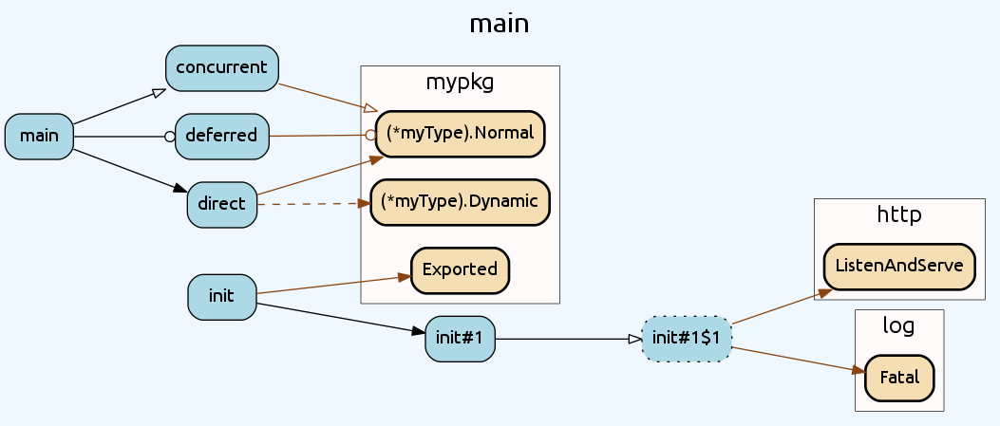
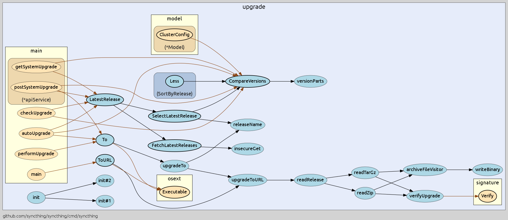

<p align="center"></p>

<h1 align="center">go-callvis</h1>

<p align="center">
  <a href="https://github.com/ofabry/go-callvis/releases"></a>
  <a href="https://travis-ci.org/ofabry/go-callvis"></a>
  <a href="https://gophers.slack.com/archives/go-callvis"></a>
</p>

<p align="center"><b>go-callvis</b> is a development tool to help visualize call graph of a Go program using interactive view.</p>

---

## Introduction

The purpose of this tool is to provide developers with a visual overview of a Go program using data from call graph 
and its relations with packages and types. This is especially useful in larger projects where the complexity of 
the code much higher or when you are just simply trying to understand code of somebody else.

### Features

- 🆕 **support for Go modules!** :boom:
- focus specific package in the program
- click on package to quickly switch the focus using [interactive viewer](#interactive-viewer)
- group functions by package and/or methods by type
- filter packages to specific import path prefixes
- ignore funcs from standard library
- omit various types of function calls

### Output preview

[](https://raw.githubusercontent.com/ofabry/go-callvis/master/images/main.png)

> Check out the [source code](examples/main) for the above image.

### How it works

It runs [pointer analysis](https://godoc.org/golang.org/x/tools/go/pointer) to construct the call graph of the program and 
uses the data to generate output in [dot format](http://www.graphviz.org/content/dot-language), which can be rendered with Graphviz tools.

## Reference guide

Here you can find descriptions for various types of output.

### Packages / Types

|Represents  | Style|
|----------: | :-------------|
|`focused`   | **blue** color|
|`stdlib`    | **green** color|
|`other`     | **yellow** color|

### Functions / Methods

|Represents   | Style|
|-----------: | :--------------|
|`exported`   | **bold** border|
|`unexported` | **normal** border|
|`anonymous`  | **dotted** border|

### Calls

|Represents   | Style|
|-----------: | :-------------|
|`internal`   | **black** color|
|`external`   | **brown** color|
|`static`     | **solid** line|
|`dynamic`    | **dashed** line|
|`regular`    | **simple** arrow|
|`concurrent` | arrow with **circle**|
|`deferred`   | arrow with **diamond**|

## Quick start

#### Requirements

- [Go](https://golang.org/dl/) 1.13+
- [Graphviz](http://www.graphviz.org/download/) (optional, required only with `-graphviz` flag)

### Installation

```sh
go get -u github.com/ofabry/go-callvis
# or
git clone https://github.com/ofabry/go-callvis.git
cd go-callvis && make install
```

### Usage

#### Interactive viewer

To use the interactive view provided by a web server that serves SVG images of focused packages, you can simply run:

`go-callvis <target package>` 

HTTP server is listening on [http://localhost:7878/](http://localhost:7878/) by default, use option `-http="ADDR:PORT"` to change HTTP server address.

#### Render static output

To generate a single output file use option `-file=<file path>` to choose output file destination.

The output format defaults to `svg`, use option `-format=<svg|png|jpg|...>` to pick a different output format.

#### Options

```
Usage of go-callvis:
  -debug
    	Enable verbose log.
  -file string
    	output filename - omit to use server mode
  -cacheDir string
    	Enable caching to avoid unnecessary re-rendering.
  -focus string
    	Focus specific package using name or import path. (default "main")
  -format string
    	output file format [svg | png | jpg | ...] (default "svg")
  -graphviz
    	Use Graphviz's dot program to render images.
  -group string
    	Grouping functions by packages and/or types [pkg, type] (separated by comma) (default "pkg")
  -http string
    	HTTP service address. (default ":7878")
  -ignore string
    	Ignore package paths containing given prefixes (separated by comma)
  -include string
    	Include package paths with given prefixes (separated by comma)
  -limit string
    	Limit package paths to given prefixes (separated by comma)
  -minlen uint
    	Minimum edge length (for wider output). (default 2)
  -nodesep float
    	Minimum space between two adjacent nodes in the same rank (for taller output). (default 0.35)
  -nointer
    	Omit calls to unexported functions.
  -nostd
    	Omit calls to/from packages in standard library.
  -rankdir
        Direction of graph layout [LR | RL | TB | BT] (default "LR")
  -skipbrowser
    	Skip opening browser.
  -tags build tags
    	a list of build tags to consider satisfied during the build. For more information about build tags, see the description of build constraints in the documentation for the go/build package
  -tests
    	Include test code.
  -version
    	Show version and exit.
```

Run `go-callvis -h` to list all supported options.

## Examples

Here is an example for the project [syncthing](https://github.com/syncthing/syncthing).

[](https://raw.githubusercontent.com/ofabry/go-callvis/master/images/syncthing.png)

> Check out [more examples](examples) and used command options.

## Community

Join [#go-callvis](https://gophers.slack.com/archives/go-callvis) channel at [gophers.slack.com](http://gophers.slack.com). (*not a member yet?* [get invitation](https://gophersinvite.herokuapp.com))

### How to help

Did you find any bugs or have some suggestions?
- Feel free to open [new issue](https://github.com/ofabry/go-callvis/issues/new) or start discussion in the slack channel.

Do you want to contribute to the project?
- Fork the repository and open a pull request. [Here](https://github.com/ofabry/go-callvis/projects/1) you can find TODO features.

---

#### Roadmap

##### The *interactive tool* described below has been published as a *separate project* called [goexplorer](https://github.com/ofabry/goexplorer)!

> Ideal goal of this project is to make web app that would locally store the call graph data and then provide quick access of the call graphs for any package of your dependency tree. At first it would show an interactive map of overall dependencies between packages and then by selecting particular package it would show the call graph and provide various options to alter the output dynamically.
