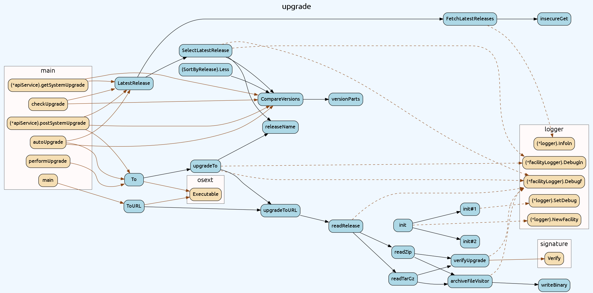

# go-callvis

go-callvis is a development tool to help visualize call graph of your Go program.

Intented purpose of this tool is to show overview of your code's structure by visually representing call graph and type relations. This is especially useful in larger projects where the complexity of the code rises.

It runs [pointer analysis](https://godoc.org/golang.org/x/tools/go/pointer) to construct the call graph of the program and uses the data to generate output in [dot format](http://www.graphviz.org/content/dot-language), which can be rendered with graphviz tools.

## Installation

> `go get -u -v github.com/TrueFurby/go-callvis`

## Features

- **focus** specific package
- **limit** package path to prefix
- **ignore** package paths with prefix
- group functions by **type/pkg**

## Examples

Here's example usage for [syncthing](https://github.com/syncthing/syncthing) program focusing _upgrade_ package:


```
go-callvis -focus upgrade -limit github.com/syncthing/syncthing github.com/syncthing/syncthing/cmd/syncthing | dot -Tpng -o syncthing.png
```

with grouping by package:



```
go-callvis -sub pkg -focus upgrade -limit github.com/syncthing/syncthing github.com/syncthing/syncthing/cmd/syncthing | dot -Tpng -o syncthing.png
```

and ignoring logger:


```
go-callvis -ignore github.com/syncthing/syncthing/lib/logger -sub pkg -focus upgrade -limit github.com/syncthing/syncthing github.com/syncthing/syncthing/cmd/syncthing | dot -Tpng -o syncthing.png
```

## Legend

Element  | Style  | Description
-------: | :----: | -----------
_node background_ |  **_blue_**  | focused package
                  | **_yellow_** | non-focused packages
    _node border_ |  **_bold_**  | exported func
                  | **_dotted_** | anonymous func
      _edge line_ | **_brown_**  | outside focused package
                  | **_dashed_** | dynamic call
     _edge arrow_ | **_empty_**  | concurrent call
    _edge circle_ | **_empty_**  | deferred call

## Goal

Ideally final objective of this project is to make web application that will store call graph data and provide fast rendering of the graphs for any package of your dependency tree.
