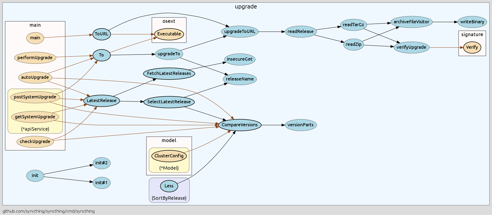

go-callvis [](https://github.com/TrueFurby/go-callvis/releases) [](https://travis-ci.org/TrueFurby/go-callvis) [](https://gophersinvite.herokuapp.com)
==========

**go-callvis** is a development tool to help visualize call graph of your Go program using Graphviz's dot format.


Intended purpose of this tool is to provide a visual overview of your program's source code structure by using call graph and type relations. This is especially useful in larger projects where the complexity of the code rises.

## Features

- focus specific package in a program
- group funcs by packages and/or types
- limit packages to custom prefix path
- ignore packages containing custom prefix

### How it works

It runs [pointer analysis](https://godoc.org/golang.org/x/tools/go/pointer) to construct the call graph of the program and uses the data to generate output in [dot format](http://www.graphviz.org/content/dot-language), which can be rendered with Graphviz tools.

## Installation

### Requirements

- [Go](https://golang.org/dl/)
- [Graphviz](http://www.graphviz.org/Download..php)

### Install

Use the following commands to install:

```
go get -u github.com/TrueFurby/go-callvis
cd $GOPATH/src/github.com/TrueFurby/go-callvis
make
```

### Usage

```
go-callvis [OPTIONS] <main pkg>

Options:
  -focus string
        Focus package with import path or name (default: main).
  -limit string
        Limit package path to prefix.
  -group string
        Grouping functions by [pkg, type] (separate multiple by comma).
  -ignore string
        Ignore package paths with prefix (separate multiple by comma).
  -tests
        Include test code.
  -debug
        Enable verbose log.
  -version
        Show version and exit.
```

## Legend

### Packages & Types

> Presented as subgraphs (clusters).

- **packages** have _normal corners_ and _label on the top_
- **types** have _rounded corners_ with _label on the bottom_

Represents  | Style
----------: | :-------------
  `focused` | _blue color_
   `stdlib` | _green color_ :collision: **NEW!**
    `other` | _yellow color_

### Functions

> Presented as nodes.

Represents   | Style
-----------: | :--------------
  `exported` | _bold border_
`unexported` | _normal border_
 `anonymous` | _dotted border_

### Calls

> Presented as edges.

Represents   | Style
-----------: | :-------------
  `internal` | _black color_
  `external` | _brown color_
    `static` | _solid line_
   `dynamic` | _dashed line_
   `regular` | _simple arrow_
`concurrent` | ~~_empty arrow_~~ _arrow with empty circle_ :warning:
  `deferred` | ~~_empty circle_~~ _arrow with empty diamond_ :warning:

## Examples

Here is example for project [syncthing](https://github.com/syncthing/syncthing).



```
go-callvis -focus upgrade -group pkg,type -limit github.com/syncthing/syncthing -ignore github.com/syncthing/syncthing/lib/logger github.com/syncthing/syncthing/cmd/syncthing | dot -Tpng -o syncthing.png
```

You can find more examples in the folder [examples](examples).

## Roadmap

Ideal goal of this project is to make web app that would locally store the call graph data and then provide quick access of the call graphs for any package of your dependency tree. At first it would show an interactive map of overall dependencies between packages and then by selecting particular package it would show the call graph and provide various options to alter the output dynamically.

## Known Issues

**execution takes a lot of time, because currently:**

- the call graph is always generated for the entire program
- there is yet no caching of call graph data

## Community

Join the [#go-callvis](https://gophers.slack.com/archives/go-callvis) channel at [gophers.slack.com](http://gophers.slack.com)
