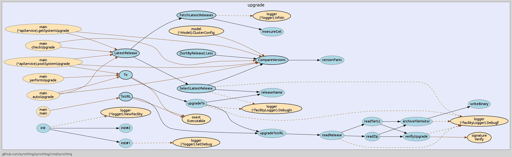

go-callvis [](https://goreportcard.com/report/github.com/TrueFurby/go-callvis) [](https://travis-ci.org/TrueFurby/go-callvis)
==========

**go-callvis** is a development tool to help visualize call graph of your Go program using Graphviz's dot format.


> check [source code](example) for this example

Intended purpose of this tool is to provide a visual overview of your program's source code structure by using call graph and type relations. This is especially useful in larger projects where the complexity of the code rises.

## Features

- focus specific package in a program
- group functions by types or packages
- limit packages to custom prefix path
- ignore packages containing custom prefix

### How it works

It runs [pointer analysis](https://godoc.org/golang.org/x/tools/go/pointer) to construct the call graph of the program and uses the data to generate output in [dot format](http://www.graphviz.org/content/dot-language), which can be rendered with Graphviz tools.

## Installation

### Requirements

- [Go](https://golang.org/dl/)
- [Graphviz](http://www.graphviz.org/Download..php)

### Install

Use the following command to install:

```
go get -u -v github.com/TrueFurby/go-callvis
```

### Usage

```
go-callvis [OPTIONS] <main pkg>

Options:
  -focus string
        Focus package with name (default: main)
  -limit string
        Limit package path to prefix
  -group string
        Grouping by [type, pkg]
  -ignore string
        Ignore package paths with prefix (separated by comma)
  -test bool
        Include test code
```

## Legend

#### Packages

Type        | Style          |                   Example
----------: | :------------- | :-----------------------------------------:
**focused** | _blue color_   |    
  **other** | _yellow color_ | 

#### Functions (_nodes_)

Type           | Style           |                  Example
-------------: | :-------------- | :----------------------------------------:
  **exported** | _bold border_   |  
**unexported** | _normal border_ | 
 **anonymous** | _dotted border_ | 

#### Calls (_edges_)

Type           | Style          |                   Example
-------------: | :------------- | :-----------------------------------------:
  **internal** | _black color_  |   
  **external** | _brown color_  |   
   **dynamic** | _dashed line_  |    
**concurrent** | _empty arrow_  | 
  **deferred** | _empty circle_ |   

## Examples

Here are usage examples for [syncthing](https://github.com/syncthing/syncthing) program.

### Focusing package _upgrade_



```
go-callvis -focus upgrade -limit github.com/syncthing/syncthing github.com/syncthing/syncthing/cmd/syncthing | dot -Tpng -o syncthing.png
```

--------------------------------------------------------------------------------

### Grouping by _packages_


```
go-callvis -group pkg -focus upgrade -limit github.com/syncthing/syncthing github.com/syncthing/syncthing/cmd/syncthing | dot -Tpng -o syncthing.png
```

--------------------------------------------------------------------------------

### Ignoring package _logger_


```
go-callvis -ignore github.com/syncthing/syncthing/lib/logger -group pkg -focus upgrade -limit github.com/syncthing/syncthing github.com/syncthing/syncthing/cmd/syncthing | dot -Tpng -o syncthing.png
```

## Roadmap

Ideal goal of this project is to make web app that would locally store the call graph data and then provide quick access of the call graphs for any package of your dependency tree. At first it would show an interactive map of overall dependencies between packages and then by selecting particular package it would show the call graph and provide various options to alter the output dynamically.

## Known Issues

**execution takes a lot of time (~5s), because currently:**

- the call graph is always generated for the entire program
- there is yet no caching of call graph data

## Community

Join the [#go-callvis](https://gophers.slack.com/archives/go-callvis) channel at [gophers.slack.com](http://gophers.slack.com)
