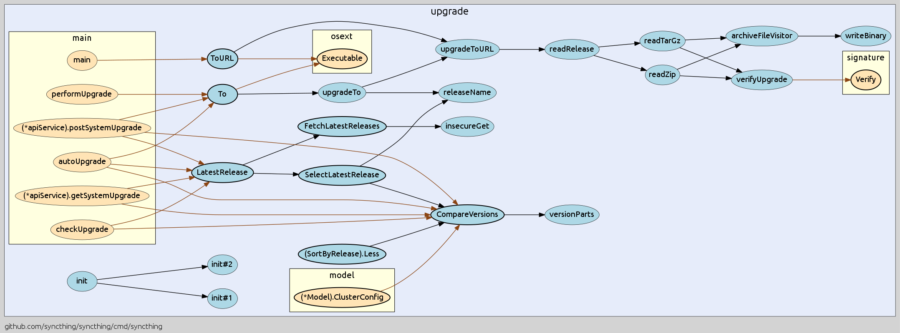

go-callvis [](https://travis-ci.org/TrueFurby/go-callvis)
==========

**go-callvis** is a development tool to help visualize call graph of your Go program using Graphviz's dot format.


Intended purpose of this tool is to provide a visual overview of your program's source code by using call graph and type relations. This is especially useful in larger projects where the complexity of the structure rises.

Features
--------

- **focus** specific **package** in program
- **limit** to include only packages containing **prefix**
- **ignore** multiple packages containing **prefix**
- **group** functions by **types/packages**

### How it works

It runs [pointer analysis](https://godoc.org/golang.org/x/tools/go/pointer) to construct the call graph of the program and uses the data to generate output in [dot format](http://www.graphviz.org/content/dot-language), which can be rendered with graphviz tools.

### Project goal

Ideal goal of this project is to make web app that would locally store the call graph data and then provide quick access of the call graphs for any package of your dependency tree. At first it would show an interactive map of overall dependencies between packages and then by selecting particular package it would show the call graph and provide various options to alter the output dynamically.

## Installation

### Requirements

- [Go](https://golang.org/dl/)
- [Graphviz](http://www.graphviz.org/Download..php)

### Install

To install the go-callvis, use the following command:

```
go get -u -v github.com/TrueFurby/go-callvis
```

Usage
-----

```
go-callvis [OPTIONS] <main pkg>

Options:
  -focus string
        focus package name (default: main)
  -ignore string
        ignore package path
  -limit string
        limit package path
  -sub string
        subgraph by [type, pkg]
```

### Legend

Element         | Style          |     Represents      |                   Example
--------------: | :------------- | :-----------------: | :-----------------------------------------:
 **node color** | _blue_         | func in focused pkg |    
                | _yellow_       |  func in other pkg  | 
**node border** | _bold_         |    exported func    |   
                | _dotted_       |   anonymous func    |  
 **edge color** | _black_        |   internal calls    |    
                | _brown_        |   external calls    |    
  **edge line** | _dashed_       |    dynamic calls    |    
**arrow shape** | _empty arrow_  |  concurrent calls   | 
**arrow shape** | _empty circle_ |   deferred calls    |   

Examples
--------

Here are usage examples for [syncthing](https://github.com/syncthing/syncthing) program.

### Focusing package _upgrade_


```
go-callvis -focus upgrade -limit github.com/syncthing/syncthing github.com/syncthing/syncthing/cmd/syncthing | dot -Tpng -o syncthing.png
```

--------------------------------------------------------------------------------

### Grouping by packages


```
go-callvis -sub pkg -focus upgrade -limit github.com/syncthing/syncthing github.com/syncthing/syncthing/cmd/syncthing | dot -Tpng -o syncthing.png
```

--------------------------------------------------------------------------------

### Ignoring package _logger_



```
go-callvis -ignore github.com/syncthing/syncthing/lib/logger -sub pkg -focus upgrade -limit github.com/syncthing/syncthing github.com/syncthing/syncthing/cmd/syncthing | dot -Tpng -o syncthing.png
```

Known Issues
------------

**execution takes a lot of time (~5s), because currently:**
  - the call graph is always generated for the entire program
  - there is yet no caching of call graph data

Community
---------

Join the [#go-callvis](https://gophers.slack.com/archives/go-callvis) channel at [gophers.slack.com](http://gophers.slack.com)
