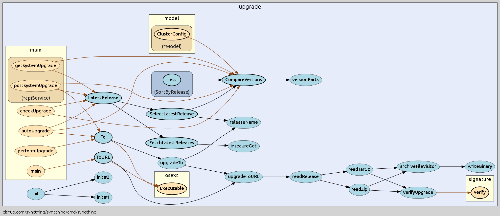

# Examples

This document contains examples of various projects from Github.

#### Projects
  - [Syncthing](https://github.com/syncthing/syncthing)
  - [Docker](https://github.com/docker/docker)
  - [Travis CI Worker](https://github.com/travis-ci/worker)


## Syncthing

[](https://raw.githubusercontent.com/ofabry/go-callvis/master/images/syncthing.png)

```sh
go get -u github.com/syncthing/syncthing/
cd $GOPATH/src/github.com/syncthing/syncthing

# Syncthing needs a special build process, so don't forget to call build.sh
./build.sh
```

# Generate graph and launch webserver
```sh
go-callvis -focus upgrade -group pkg,type -limit github.com/syncthing/syncthing -ignore github.com/syncthing/syncthing/lib/logger github.com/syncthing/syncthing/cmd/syncthing
```

---

### Focusing package _upgrade_

[](https://raw.githubusercontent.com/ofabry/go-callvis/master/images/syncthing_focus.png)

```sh
go-callvis -format=png -file=syncthing_focus -focus upgrade -limit github.com/syncthing/syncthing github.com/syncthing/syncthing/cmd/syncthing
```
---

### Grouping by _packages_

[](https://raw.githubusercontent.com/ofabry/go-callvis/master/images/syncthing_group.png)

# Generate graph focused on module 'upgrade', output to PNG file
```sh
go-callvis -format=png -file=syncthing_group -focus upgrade -group pkg -limit github.com/syncthing/syncthing github.com/syncthing/syncthing/cmd/syncthing
```
---

### Ignoring package _logger_

[](https://raw.githubusercontent.com/ofabry/go-callvis/master/images/syncthing_ignore.png)

# Generate graph focused on module 'upgrade' and ignoring 'logger', output to webserver
```sh
go-callvis -focus upgrade -group pkg -ignore github.com/syncthing/syncthing/lib/logger -limit github.com/syncthing/syncthing github.com/syncthing/syncthing/cmd/syncthing
```
---

## Docker

[](https://raw.githubusercontent.com/ofabry/go-callvis/master/images/docker.png)

```sh
go-callvis -format=png -file=docker -limit github.com/docker/docker -ignore github.com/docker/docker/vendor github.com/docker/docker/cmd/docker | dot -Tpng -o docker.png
```
---

## Travis CI Worker

[](https://raw.githubusercontent.com/ofabry/go-callvis/master/images/travis.jpg)

```sh
go-callvis -format=svg -file=travis -minlen 3 -nostd -group type,pkg -focus worker -limit github.com/travis-ci/worker -ignore github.com/travis-ci/worker/vendor github.com/travis-ci/worker/cmd/travis-worker && exo-open travis.svg
```
